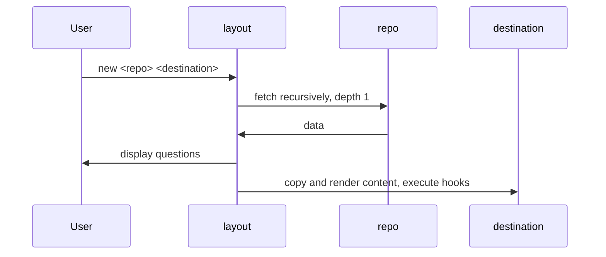

# Layout - generate new project from layout

Heavily inspired by [cookiecutter](https://github.com/cookiecutter/cookiecutter) and [yeoman](https://yeoman.io), however layout offers additional features and bonuses:

- single binary without runtime dependencies, compiled for all major OS
- supports boolean variables ([yikes, cookicutter!](https://github.com/cookiecutter/cookiecutter/issues/126))
- supports conditional variables ([cookiecutter, I am again pointing to you](https://github.com/cookiecutter/cookiecutter/issues/1438))
- supports plain includes and conditional includes
- supports (and validates): string, boolean, list of strings, integer, float
- supports versioning in case you want to lock specific version of `layout`
- supports file source and remote Git repository
- supports multiple inline hooks (with portable shell) and templated hooks 
- hooks also supports condition :-)
- supports normal labeling for variables input (cookiecuter...)

I generally do not like competing with another open-source projects but this time
I would like to say that this project aiming to fix legacy cookiecutter's problems
and keep best of three worlds (including yeoman and Go).

The utility designed to be completely universal not just in terms of supported languages
and approaches, but also in terms of operational experience and can be used in restricted environment with the same
convenience as in public.

This project is stands on open-source atlantis shoulders:

- [MVDan's protable shell](https://mvdan.cc/sh/) which allows writing inline shell script regardless of OS
- [Tengo language](https://github.com/d5/tengo) which provides complete, simple and fast language for conditions
- [Go-git](https://github.com/go-git/go-git) which is basically embedded go-native Git client
- [Survey](https://github.com/AlecAivazis/survey) provides fancy terminal UI
- [Masterminds](https://github.com/Masterminds) for supporting tools

... and many many others. I love open-source, and this project is my payback.
That's why [license](LICENSE) for the project is Apache 2.0 which means that you may use code as you wish but please
state changes (for legal details please read LICENSE file).

## Architecture




## Tengo

Helpers:

- `has(seq, opt) -> bool` returns true if `seq` contains value `opt`. Mostly used for checking selected options (type: `list`)


## Magic variables

- `dirname` (usage: `{{.dirname}}`) - base name of destination directory, commonly used as project name


## Defaults

The `default:` section is similar to `computed`, however, invoked before user input and can not contain conditions. 
Most often it could be useful together with conditional include to prevent excluded variables be undefined in expressions.

Example:

_manifest.yaml_

```yaml
prompts:
  - var: ask_name
    type: bool
  - include: name.yaml
    when: ask_name
after:
  - run: echo Hello {{.name}}
    when: name != ""
```

_name.yaml_

```yaml
- var: name
```

In case `ask_name` set to `false` the hook **will fail** because in hook condition `name != ""` used undefined variable.

To fix it, you may update manifest with defaults variables:


_manifest.yaml_

```yaml
default:
  - var: name
    value: ""
prompts:
  - var: ask_name
    type: bool
  - include: name.yaml
    when: ask_name
after:
  - run: echo Hello {{.name}}
    when: name != ""
```

## Configuration

The global configuration file defines user-wide settings such as: abbreviations or default repository template. 

If `--config, -c` not provided, the global configuration file will be used which is located under `<user config dir>/layout/layout.yaml`.
You may check actual location by command `layout show config-file`.

Specifically:

* On Unix systems, `$XDG_CONFIG_HOME/layout/layout.yaml` or `$HOME/.config` (if `$XDG_CONFIG_HOME` not set).
* On Darwin (Mac), `$HOME/Library/Application Support/layout/layout.yaml`
* On Windows, `%AppData%/layout/layout.yaml`
* On Plan 9, `$home/lib/layout/layout.yaml`

Currently, it supports:

* `abbreviations`: map of string -> template values where key is repo shorthand and template is string with `{0}`
which will be replaced to the repo details. You may use abbreviations as `<abbr>:<owner>/<repo>`
* `default`: template for repository without shorthand, default (if not set) is `git@github.com:{0}.git`.

Example:

```yaml
default: "git@gitlab.com:{0}.git" # sets default repo to GitLab instead of GitHub. Could be used as some-owner/some-repo
abbreviations:
  ex: "ssh://git@git.example.com/{0}.git" # could be used as ex:some-owner/some-repo
```

Planning features:

- global default values
- global before/after hooks

