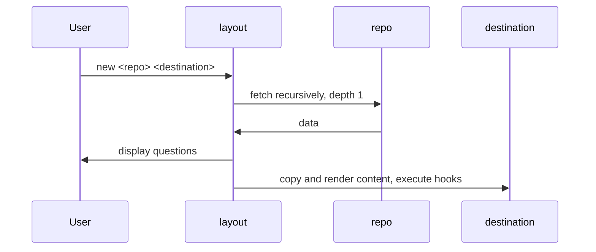

# Layout

Generate new project from layout. Supports typed user-input, hooks, and conditions.

Inspired by  [cookiecutter](https://github.com/cookiecutter/cookiecutter), [yeoman](https://yeoman.io), and Ansible.

You may think about it as cookicutter-ng or modern cookiecutter.

## Very quick demo

`layout new reddec/layout-example my-example`

Will ask you questions and generate hello-world HTML page based on your answers.

[](https://asciinema.org/a/zDPT7o2sbxOjPHoNd5z0qnxvG)

## Installation

**Pre-build binary**: prepared for most OS in [releases](https://github.com/reddec/layout/releases).

**Debian packages**:  in [releases](https://github.com/reddec/layout/releases).

**From source**: requires Go 1.18+, `go install github.com/reddec/layout@latest`

**Brew**: `brew install reddec/tap/layout`


> Tip: GitHub times-to-time updates public key, so I highly recommend re-scan GitHub public keys
> by `ssh-keyscan github.com  >> ~/.ssh/known_hosts`

## Motivation

Heavily inspired by [cookiecutter](https://github.com/cookiecutter/cookiecutter) and [yeoman](https://yeoman.io),
however layout offers additional features and bonuses:

- single binary without runtime dependencies, compiled for all major OS
- supports boolean variables ([yikes, cookicutter!](https://github.com/cookiecutter/cookiecutter/issues/126))
- supports conditional
  variables ([cookiecutter, I am again pointing to you](https://github.com/cookiecutter/cookiecutter/issues/1438))
- supports plain includes and conditional includes (inspired by Ansible)
- supports (and validates): string, boolean, list of strings, integer, float
- supports versioning in case you want to lock specific version of `layout`
- supports file source and remote Git repository (even without installed `git`!)
- supports multiple inline hooks (with portable shell) and templated hooks
- hooks also supports condition :-)
- supports normal labeling for variables input (cookiecuter...)

I generally do not like competing with another open-source projects but this time
I would like to say that this project aiming to fix legacy cookiecutter's problems
and keep best of three worlds (including yeoman and Go).

The utility designed to be completely universal not just in terms of supported languages
and approaches, but also in terms of operational experience and can be used in restricted environment with the same
convenience as in public.

This project is stands on open-source atlantis shoulders:

- [MVDan's protable shell](https://mvdan.cc/sh/) which allows writing inline shell script regardless of OS
- [Tengo language](https://github.com/d5/tengo) which provides complete, simple and fast language for conditions
- [Go-git](https://github.com/go-git/go-git) which is basically embedded go-native Git client
- [Survey](https://github.com/AlecAivazis/survey) provides fancy terminal UI
- [Masterminds](https://github.com/Masterminds) for supporting tools

... and many many others. I love open-source, and this project is my payback.
That's why [license](LICENSE) for the project is Apache 2.0 which means that you may use code as you wish but please
state changes (for legal details please read LICENSE file).

## Architecture



Let's describe basic example.
Assume we made demo repository as layout which located in `https://example.com/reddec/example`.

Once you executes `layout new https://example.com/reddec/example my-example`:

1. `layout` goes to server which hosts repository (`example.com`) by desired protocol (`https`) and asks for content of
   repository `example` owned by `reddec`.
2. (optionally) `layout` negotiates authorization protocols being aware of configuration in `.gitconfig`
3. `layout`  makes shallow (depth 1) clone of repo to a temporary directory
4. `layout` reads `layout.yaml` and asks questions from user
5. `layout` creates destination directory (`my-example`) and copies data from `content` directory from cloned repo as-is
6. `layout` executes `before` hooks
7. `layout` renders file names and removes files and directories with empty names
8. `layout` renders content of files except marked as ignored in `ignore` section
9. `layout` executes `after` hooks
10. done

> In reality, `layout` will first try to resolve URL as local directory, as abbreviation,
> and only at last it will decide go to remote URL

By default, for GitHub repositories host and protocol not needed. For example, instead
of `layout new https://github.com/reddec/example my-example` we can use `layout new reddec/example my-example`.
See [configuration](#configuration) for details.

## Layout structure

Each repository should contain:

- `layout.yaml` - main manifest file
- `content` - content directory which will be copied to the destination

### Manifest

Check examples in:

- https://example.com/reddec/example
- [test data](test-data) directory

**absolute minimal example of manifest:**

```yaml
{}
```

Yes, empty object is valid manifest.

**'hello world' example of manifest:**

```yaml
prompts:
  - var: name
after:
  - run: "wall 'Hello, {{.name}}!'"
```

(*nix only, should broadcast message `Hello, <yourname>!`)

#### Version

Layout manifest supports constraints of applied layout binary version based on [semver](github.com/Masterminds/semver).

In case `version` is not specified, all versions of `layout` are allowed.

For now, I suggest pinning major version only: `~1`. `layout` is following semantic version and all version withing
one major version are backward compatible (manifest designed for `1.0.0` will work normally even in `layout`
version `1.9.5`, but without guarantees for `2.0.0`).

#### Computed

The `computed:` invoked after user input and can contain conditions.
Most often it could be useful for defining re-usable variable which depends on user-input. For example:

```yaml
prompts:
  - var: owner
  - var: repo
computed:
  - var: github_url
    value: "https://github.com/{{.owner}}/{{.repo}}"
```

**Note**: in case variable `value` is string, then content of the field will be rendered as template. Otherwise, it will
be used as-is.

```yaml
prompts:
  - var: owner
  - var: repo
computed:
  - var: options
    value:
      - 1234
      - "option {{.repo}}" # <-- will be used as-is with brackets since value content is array, not string
```

#### Defaults

The `default:` section is similar to `computed`, however, invoked before user input and can not contain conditions.
Most often it could be useful together with conditional include to prevent excluded variables be undefined in
expressions.

Example:

_layout.yaml_

```yaml
prompts:
  - var: ask_name
    type: bool
  - include: name.yaml
    when: ask_name
after:
  - run: echo Hello {{.name}}
    when: name != ""
```

_name.yaml_

```yaml
- var: name
```

In case `ask_name` set to `false` the hook **will fail** because in hook condition `name != ""` used undefined variable.

To fix it, you may update manifest with defaults variables:

_layout.yaml_

```yaml
default:
  - var: name
    value: ""
prompts:
  - var: ask_name
    type: bool
  - include: name.yaml
    when: ask_name
after:
  - run: echo Hello {{.name}}
    when: name != ""
```

Rules of rendering value in `default` section is the same as in [`computed`](#computed).

### Helpers

#### Tengo functions

Mainly used in conditions (aka `when`).

Helpers:

- `has(seq, opt) -> bool` returns true if `seq` contains value `opt`. Mostly used for checking selected options (
  type: `list`)

#### Magic variables

Could be used everywhere.

- `dirname` (usage: `{{.dirname}}`) - base name of destination directory, commonly used as project name

## Configuration

The global configuration file defines user-wide settings such as: abbreviations or default repository template.

If `--config, -c` not provided, the global configuration file will be used which is located
under `<user config dir>/layout/layout.yaml`.
You may check actual location by command `layout show config-file`.

Specifically:

* On Unix systems, `$XDG_CONFIG_HOME/layout/layout.yaml` or `$HOME/.config` (if `$XDG_CONFIG_HOME` not set).
* On Darwin (Mac), `$HOME/Library/Application Support/layout/layout.yaml`
* On Windows, `%AppData%/layout/layout.yaml`
* On Plan 9, `$home/lib/layout/layout.yaml`

Currently, it supports:

* `abbreviations`: map of string -> template values where key is repo shorthand and template is string with `{0}`
  which will be replaced to the repo details. You may use abbreviations as `<abbr>:<owner>/<repo>`
* `default`: template for repository without shorthand, default (if not set) is `git@github.com:{0}.git`.

> Hint: you may use air-gap deployment in case you stored bare repository somewhere locally.

Example:

```yaml
default: "git@gitlab.com:{0}.git" # sets default repo to GitLab instead of GitHub. Could be used as some-owner/some-repo
abbreviations:
  ex: "ssh://git@git.example.com/{0}.git" # could be used as ex:some-owner/some-repo
```

Check [roadmap](#roadmap) for upcoming features.

## Security and privacy

**Privacy**: we (authors of layout) do not collect, process or transmit anything related to your activities to our or
third-party servers with one exception.
Exception is the moment when you are cloning remote repository: we are not responsible for data leakage or tracking
activities from repo owner. We are using standard git protocol (via [go-git](https://github.com/go-git/go-git)) which
requires some "trust" to remote repository, however, this warning is not specific to only `layout`. Just be careful what
and from where you are cloning (see below).

**Security** is a bit bigger problem due to nature of idea behind the `layout`: hooks defined in manifest could
potentially do anything in computer limited by the running user permissions. There is no universal solutions for the
problem, however:

- (suggested) clone only from trusted repo
- (paranoid) execute layout in minimal sandbox environment such as docker or kvm and copy result data to the host.

See [roadmap](#roadmap) for planning related features.

## Roadmap

### Security

- clone by commit digest
- disable hooks during cloning, however, it may break all idea of `layout`

### UX

- global default values
- global before/after hooks
- globally disable hooks
- compute variables by script

#### Far plans

- GUI for prompts (maybe)
- Decentralized marketplaces/discovery repositories

### Flexibility

- allow users use native `git` binary 