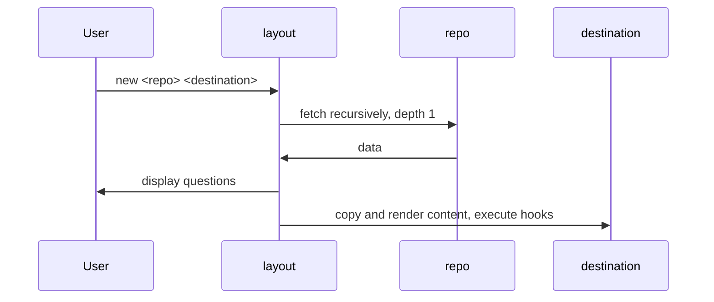

# Layout

Generate new project from layout. Supports typed user-input, hooks, and conditions.

Inspired by  [cookiecutter](https://github.com/cookiecutter/cookiecutter), [yeoman](https://yeoman.io), and Ansible.

You may think about it as cookicutter-ng or modern cookiecutter.

## Very quick demo

`layout new reddec/layout-example my-example`

Will ask you questions and generate hello-world HTML page based on your answers.

[](https://asciinema.org/a/zDPT7o2sbxOjPHoNd5z0qnxvG)

## Installation

- **Pre-build binary**: prepared for most OS in [releases](https://github.com/reddec/layout/releases).
- **DEB/RPM/APK packages**:  in [releases](https://github.com/reddec/layout/releases).
- **From source**: requires Go 1.18+, `go install github.com/reddec/layout@latest`
- **Brew**: `brew install reddec/tap/layout`
- **Docker**: (supports amd64 and arm64)
    - `ghcr.io/reddec/layout:latest`
    - `ghcr.io/reddec/layout:<version>`

Note 1: Docker image built from `scratch` and not very useful by itself. Intended to be used as part of multi-stage
Docker build.

Note 2: During cloning from GitHub you may observe SSH-key related error, which usually happens because of GitHub key
rotation. It could be fixed by `ssh-keyscan github.com  >> ~/.ssh/known_hosts`

## Motivation

Heavily inspired by [cookiecutter](https://github.com/cookiecutter/cookiecutter) and [yeoman](https://yeoman.io),
however layout offers additional features and bonuses:

- single binary without runtime dependencies, compiled for all major OS
- supports boolean variables ([yikes, cookicutter!](https://github.com/cookiecutter/cookiecutter/issues/126))
- supports conditional
  variables ([cookiecutter, I am again pointing to you](https://github.com/cookiecutter/cookiecutter/issues/1438))
- supports plain includes and conditional includes (inspired by Ansible)
- supports (and validates): string, boolean, list of strings, integer, float
- supports versioning in case you want to lock specific version of `layout`
- supports file source and remote Git repository (even without `git` installed!)
- supports multiple inline hooks (with portable shell) and templated hooks
- hooks also supports condition :-)
- supports normal labeling for variables input (cookiecuter...)
- supports multiple layout in one repo

I generally do not like competing with other open-source projects but this time
I would like to say that this project is aiming to fix legacy cookiecutter's problems
and keep the best of three worlds (including yeoman and Go).

The utility is designed to be completely universal not just in terms of supported languages
and approaches, but also in terms of operational experience and can be used in restricted (limited to no-access to
internet) environment with the same convenience as in public.

This project stands on open-source atlantis shoulders:

- [MVDan's protable shell](https://mvdan.cc/sh/) which allows writing inline shell script regardless of OS
- [Tengo language](https://github.com/d5/tengo) which provides complete, simple and fast language for conditions
- [Go-git](https://github.com/go-git/go-git) which is basically embedded go-native Git client
- [Survey](https://github.com/AlecAivazis/survey) provides fancy terminal UI
- [Masterminds](https://github.com/Masterminds) for supporting tools

... and many many others. I love open-source, and this project is one of my little contributions.
That's why [license](LICENSE) for the project is Apache 2.0 which means that you may use code as you wish but please
state any changes (for legal details please read LICENSE file).

## Documentation

- Use GitHub navigation on top of README, or use search-on-page functionality in your viewer
- Use `layout new --help` command to check usage

### CLI usage

#### General

    Usage:
    layout [OPTIONS] <new | show>
    
    Create new project based on layout
    Author: Aleksandr Baryshnikov <owner@reddec.net>
    
    Help Options:
    -h, --help  Show this help message
    
    Available commands:
    new   deploy layout
    show  show configuration

#### show

    Usage:
    layout [OPTIONS] show <config | config-file>
    
    Help Options:
    -h, --help      Show this help message
    
    Available commands:
    config       current config
    config-file  location of default config file

#### new

    Usage:
    layout [OPTIONS] new [new-OPTIONS] [source] [destination]

    Help Options:
    -h, --help                       Show this help message
    
    [new command options]
        --version=                   Override binary version to bypass manifest restriction [$LAYOUT_VERSION]
    -c, --config=                    Path to configuration file, use show config command to locate default location [$LAYOUT_CONFIG]
    -u, --ui=[nice|simple]           UI mode (default: nice) [$LAYOUT_UI]
    -d, --debug                      Enable debug mode [$LAYOUT_DEBUG]
    -a, --ask-once                   Do not retry on wrong user input, good for automation [$LAYOUT_ASK_ONCE]
    -D, --disable-cleanup            Disable removing created dirs in case of failure [$LAYOUT_DISABLE_CLEANUP]
    -g, --git=[auto|native|embedded] Git client (default: auto) [$LAYOUT_GIT]

* `-g,--git` (v1.2.0+) specifies git client which should be used:
    * `native` use native Git binary (must be 2.13+)
    * `embedded` use Golang native git client (safe mode)
    * `auto` (default, but it can be changed in [configuration](#configuration)) in case git installed (`git` binary
      accessible) and git version is 2.13 or higher `native` will be used, otherwise `embedded`

##### set

Since v1.3.1

    Usage:
    layout [OPTIONS] set <default | git>
    
    Help Options:
    -h, --help      Show this help message
    
    Available commands:
    default  URL pattern to resolve layout
    git      git client mode

### Architecture



Let's describe basic example.
Assume we made demo repository as layout which located in `https://github.com/reddec/layout-example`.

Once you executes `layout new https://github.com/reddec/layout-example my-example`:

1. `layout` goes to server which hosts repository (`github.com`) by desired protocol (`https`) and asks for content of
   repository `layout-example` owned by `reddec`.
2. (optionally) `layout` negotiates authorization protocols being aware of configuration in `.gitconfig`
3. `layout`  makes shallow (depth 1) clone of repo to a temporary directory
4. `layout` reads `layout.yaml` and asks questions from user
5. `layout` creates destination directory (`my-example`) and copies data from `content` directory from cloned repo as-is
6. `layout` executes `before` hooks
7. `layout` renders file names and removes files and directories with empty names
8. `layout` renders content of files except marked as ignored in `ignore` section
9. `layout` executes `after` hooks
10. done

> In reality, `layout` will first try to resolve URL as local directory, as abbreviation,
> and only at last it will decide go to remote URL

By default, for GitHub repositories host and protocol not needed. For example, instead
of `layout new https://github.com/reddec/layout-example my-example` we can
use `layout new reddec/layout-example my-example`.
See [configuration](#configuration) for details.

### Layout structure

Once repository fetched, `layout` will scan directories with `layout.yaml` files. Each directory with such file will
be marked as project directory.

In case there is only one project directory, then it will be automatically picked. Otherwise, user will be prompted to
pick desired project (based on `title` field).

Each project directory should contain:

- `layout.yaml` - main manifest file
- `content` - content directory which will be copied to the destination

Valid repo structure:

**one repo - one layout**:

```
/
├── layout.yaml
└── content
```

**one repo - many layouts** (v1.3.0+):

```
/
├── foo
│    └── layoutA
│         ├── layout.yaml
│         └── content
└── layoutB
    ├── layout.yaml
    └── content
```

### Manifest

Check examples in:

- https://github.com.com/reddec/layout-example
- [test data](test-data) directory

**absolute minimal example of manifest:**

```yaml
{ }
```

Yes, empty object is valid manifest.

**'hello world' example of manifest:**

```yaml
prompts:
  - var: name
after:
  - run: "echo 'Hello, {{.name}}!' | wall"
```

(*nix only, should broadcast message `Hello, <yourname>!`)

#### Version

Layout manifest supports constraints of applied layout binary version based on [semver](github.com/Masterminds/semver).

In case `version` is not specified, all versions of `layout` are allowed.

For now, I suggest pinning major version only: `~1`. `layout` is following semantic version and all version withing
one major version are backward compatible (manifest designed for `1.0.0` will work normally even in `layout`
version `1.9.5`, but without guarantees for `2.0.0`).

#### Title and Description

There are two informational field in manifest:

* `title` - short description about layout. Only title will be shown to user in case of selecting manifest in
  multi-project repo
* `description` - full project description

Both title and description will be shown before prompts.

#### Delimiters

Template delimiters could be overridden by in `delimiters` section. Defaults are `{{` (open), `}}` (close).
Could be useful in case you are trying to render Go templates.

Example:

```yaml
# ...
delimiters:
  open: '[['
  close: ']]'
# ...
computed:
  - var: foo
    value: "[[.dirname]]"
# ...
```

#### Prompts

Prompts are list of variables which should be asked from user.
Minimal required field is `var: <name>` which unique identifies provided value
and could be used in conditions and templates later.

* `label` is used as a question which will shown to user. If not set - `var` name will be used as-is
* `type` variable type, default is `str`. If user input can not be casted to desired type, user will be asked again (
  unless `-a/--ask-once` provided). Supported types:
    * `str` - user input as-is (space trimmed)
    * `int` - user input should be 10-base 64-bit integer
    * `float` - user input should be 10-base 64-bit float
    * `bool` - `true` if user input (case insensitive) is `t`, `y`, `yes`, `true`, or `ok`; otherwise `false`
    * `list` - list of strings. If options are not provided, values are comma-separated
* `default` - default suggested value. Since v1.3.0 it can be an array, which is useful when you want to pick multiple
  default values for `type: list`
* `options` - allows user select single option (not `type: list`) or multiple options (type: `list`)
* `when` - condition written in  [tengo language](https://github.com/d5/tengo) which should return boolean;
  default `true`. Variable will not be defined (use [defaults](#defaults) if needed) and prompt will not be rendered or
  executed if condition returned false.

Example:

```yaml
# ...
prompts:
  # cast to integer
  - var: age
    label: What is your age
    type: int
  # conditional
  - var: tin
    label: What is your TIN
    when: age > 18
  # select one
  - var: degree
    label: What is your highest degree
    options:
      - Elementary school
      - High-School
      - Bachelor
      - Magister
      - PhD
  # select many
  - var: source_of_income
    label: Source of income
    type: list
    options:
      - employed
      - self-employed
      - business
# ...
```

#### Includes

`include` is a special instruction within [`prompts`](#prompts) which loads separate yaml
file, relative to the current, with list of another prompts.

Used as a convenient method to group questions blocks.

Example:

_layout.yaml_

```yaml
# ...
prompts:
  - var: age
    label: What is your age
    type: int

  - include: adult.yaml
    when: age > 18
# ...
```

_adult.yaml_

```yaml
- var: tin
  label: What is your TIN

- var: degree
  label: What is your highest degree
  options:
    - Elementary school
    - High-School
    - Bachelor
    - Magister
    - PhD

- var: source_of_income
  label: Source of income
  type: list
  options:
    - employed
    - self-employed
    - business
```

#### Computed

The `computed:` invoked after user input and can contain conditions.
Most often it could be useful for defining re-usable variable which depends on user-input. For example:

```yaml
prompts:
  - var: owner
  - var: repo
computed:
  - var: github_url
    value: "https://github.com/{{.owner}}/{{.repo}}"
```

**Note**: in case variable `value` is string, then content of the field will be rendered as template. Otherwise, it will
be used as-is.

```yaml
prompts:
  - var: owner
  - var: repo
computed:
  - var: options
    value:
      - 1234
      - "option {{.repo}}" # <-- will be used as-is with brackets since value content is array, not string
```

#### Defaults

The `default:` section is similar to `computed`, however, invoked before user input and can not contain conditions.
Most often it could be useful together with conditional include to prevent excluded variables be undefined in
expressions.

Example:

_layout.yaml_

```yaml
prompts:
  - var: ask_name
    type: bool
  - include: name.yaml
    when: ask_name
after:
  - run: echo Hello {{.name}}
    when: name != ""
```

_name.yaml_

```yaml
- var: name
```

In case `ask_name` set to `false` the hook **will fail** because in hook condition `name != ""` used undefined variable.

To fix it, you may update manifest with defaults variables:

_layout.yaml_

```yaml
default:
  - var: name
    value: ""
prompts:
  - var: ask_name
    type: bool
  - include: name.yaml
    when: ask_name
after:
  - run: echo Hello {{.name}}
    when: name != ""
```

Rules of rendering value in `default` section is the same as in [`computed`](#computed).

Defaults also can be defined globally in [configuration](#configuration). Optionally, to make layout portable you may
use template in default section.

_$XDG_CONFIG_HOME/layout/layout.yaml_

```yaml
values:
  country: Global
```

_layout.yaml_

```yaml
default:
  - var: country
    value: '{{with .country}}{{.}}{{else}}my-default-country{{end}}'
```

#### Ignore

Ignore list allows you define list of [glob](https://pkg.go.dev/path/filepath#Glob) patterns of paths which should not
be rendered as template.

Example:

```yaml
ignore:
  - "**/*.css" # do not treat as template CSS files
```

#### Hooks

Hooks can be defined through inline portable shell or through templated script.

* `before` hooks executed with resolved state (after user input and computed variables), before rendering paths and
  content
* `after` hooks executed after content rendered

Optionally, a `label` could be defined to show human-friendly text during execution.

Working directory for script and inline always inside destination directory. For script invocation, path to script is
relative to layout content.

Example:

```yaml
#...
before:
  # inline script
  - label: Save current date
    run: date > created.txt
after:
  # file script
  - label: Say hello
    script: hooks/hello.sh "{{.dirname}}"
#...
```

Content of `hooks/hello.sh` could be (`foo` should be defined):

```shell
#!/bin/sh

wall Hello "{{.foo}}" "$1"
```

### Rendering

By-default, all files in `content` directory treated as [golang template](https://pkg.go.dev/text/template), unless some
paths added to [`ignore`](#ignore) section.

All defined variables are accessible in a root context: `var: foo` is available as `{{.foo}}`

Additional "magic" vairables:

- `dirname` (usage: `{{.dirname}}`) - base name of destination directory, commonly used as project name

#### Functions

* [Sprig template utilities](http://masterminds.github.io/sprig/) available.
* Custom functions:
    * `getRootFile` (v1.2.1+) - (`{{getRootFile "myfile"}}`) get content of file with specific name in any of root
      folders. Example:

           Current working directory: /foo/bar/xyz
           Looking for name: .gitignore
           Will check (and return content):
              /foo/bar/xyz/.gitignore
              /foo/bar/.gitignore
              /foo/.gitignore
              /.gitignore

      If nothing found - `ErrNotExists` returned
    * `findRootFile` (v1.3.2+) - (`{{findRootFile "myfile"}}`) find path to file with specific name in any of root
      folders. Same as `getRootFile` but instead of returning content it returning path to file.

#### Flow

In manifest, the following items also renders just before usage:

- in [prompts](#prompts)
    - label
    - include
    - default
    - options
- in [computed](#computed)
    - value (if string)
- in [defaults](#defaults)
    - value (if string)
- in [hooks](#hooks)
    - run
    - script

Directories and file names can contain templates too. Ex: `content/src/{{.project}}/main-{{.foo}}.go`.

In case path segment rendered to an empty string, the segment will be removed (mimics cookiecutter behaviour).

### Condition expression

Statement written in [tengo language](https://github.com/d5/tengo) which should return boolean.

Can be used in:

- [prompts](#prompts) and [includes](#includes)
- [computed](#computed)
- [hooks](#hooks)

Helpers:

- `has(seq, opt) -> bool` returns true if `seq` contains value `opt`. Mostly used for checking selected options (
  type: `list`)

Example:

```yaml
# ...
prompts:
  - var: features
    options:
      - http
      - ui
      - js
    type: list

  - include: http.yaml
    when: 'has(features, "http")'
# ...
```

### Configuration

The global configuration file defines user-wide settings such as:

* abbreviations
* default repository template
* global default variables

If `--config, -c` not provided, the global configuration file will be used which is located
under `<user config dir>/layout/layout.yaml`.
You may check actual location by command `layout show config-file`.

Specifically:

* On Unix systems, `$XDG_CONFIG_HOME/layout/layout.yaml` or `$HOME/.config` (if `$XDG_CONFIG_HOME` not set).
* On Darwin (Mac), `$HOME/Library/Application Support/layout/layout.yaml`
* On Windows, `%AppData%/layout/layout.yaml`
* On Plan 9, `$home/lib/layout/layout.yaml`

Currently, it supports:

* `abbreviations`: map of string -> template values where key is repo shorthand and template is string with `{0}`
  which will be replaced to the repo details. You may use abbreviations as `<abbr>:<owner>/<repo>`
* `default`: template for repository without shorthand, default (if not set) is `git@github.com:{0}.git`.
* `values`: (v1.2.0+) map of anything where key as name and value is default value (any valid YAML type)
* `git`: (v1.3.1+) preferred git mode (same as in [cli](#new)): `auto` (default), `native`, `embedded`

> Hint: you may use air-gap deployment in case you stored bare repository somewhere locally.

Example:

```yaml
default: "git@gitlab.com:{0}.git" # sets default repo to GitLab instead of GitHub. Could be used as some-owner/some-repo
abbreviations:
  ex: "ssh://git@git.example.com/{0}.git" # could be used as ex:some-owner/some-repo
values:
  author: RedDec
  organization: myself
```

Check [roadmap](#roadmap) for upcoming features.

## UI

Currently, layout provide two terminal UI:

- `nice` (default) - colored, interactive UI, backed by [Survey](https://github.com/AlecAivazis/survey)
- `simple` - plain STDIN/STDOUT UI, which can be useful for automation or for basic terminals

You may pick UI kind for `new` [command](#new) by flag `--ui <kind>` or `-u <kind>`.

For example, to use simple UI: `layout new -u simple reddec/layout-example my-example`.

## Automation

`layout` supports naive automation where input variables are fed through STDIN.
Use `layout new -u simple -a <repo> <dir>` to simplify integration with another tools:

- `-u simple` disables interactive [colorful UI](#ui)
- `-a` enables mode "ask once" for `new` [command](#new) which disables retry-loop in case of malformed user input

## Security and privacy

**Privacy**: we (authors of layout) do not collect, process or transmit anything related to your activities to our or
third-party servers with one exception.
Exception is the moment when you are cloning remote repository: we are not responsible for data leakage or tracking
activities from repo owner. We are using standard git protocol (via [go-git](https://github.com/go-git/go-git)) which
requires some "trust" to remote repository, however, this warning is not specific to only `layout`. Just be careful what
and from where you are cloning (see below).

**Security** is a bit bigger problem due to nature of idea behind the `layout`: hooks defined in manifest could
potentially do anything in computer limited by the running user permissions. There is no universal solutions for the
problem, however:

- (suggested) clone only from trusted repo
- (paranoid) execute layout in minimal sandbox environment such as docker or kvm and copy result data to the host.

Anyway: running `layout` under `root` privileges is a TERRIBLE IDEA, you should never do it.

See [roadmap](#roadmap) for planning related features.

## Roadmap

- Security
    - clone by commit digest
    - disable hooks during cloning, however, it may break all idea of `layout`
- UX
    - global before/after hooks
    - globally disable hooks
    - compute variables by script
- Delivery
    - apt repository
    - Arch AUR
- Long term ideas
    - GUI for prompts (maybe)
    - Decentralized marketplaces/discovery repositories

## Contributing

PR/Issues/Feedback always welcome.

### Rules

- Be professional and avoid personal conflicts. I strongly believe that FOSS still can be a cross-broder collaboration
  regardless of politics (at least we can try).
- No CLA (contributor license agreement), no corporate bullshit - once your code is merged it's available for everyone
  under Apache 2.0 license
    - Do not forget to add or update Apache 2.0 header in code!
- No one is perfect, if you have an idea/draft of code - make draft PR and let's talk about how to improve it. If you
  can -
  help others to complete their ideas
- Do not demand from volunteers immediate reaction. If you want to prioritize your problem - motivate them (for example:
  contact me directly) by donation or by any other form

### Flow

- Standard GitHub flow:
    - fork
    - make PR (draft PRs are not reviewed)
    - ask for review -> fix problems -> ask review (loop)
    - done! (PR merged)

Do not hesitate to ping maintainers again and again. Maintainers are busy and your review request may sink under
others problems.